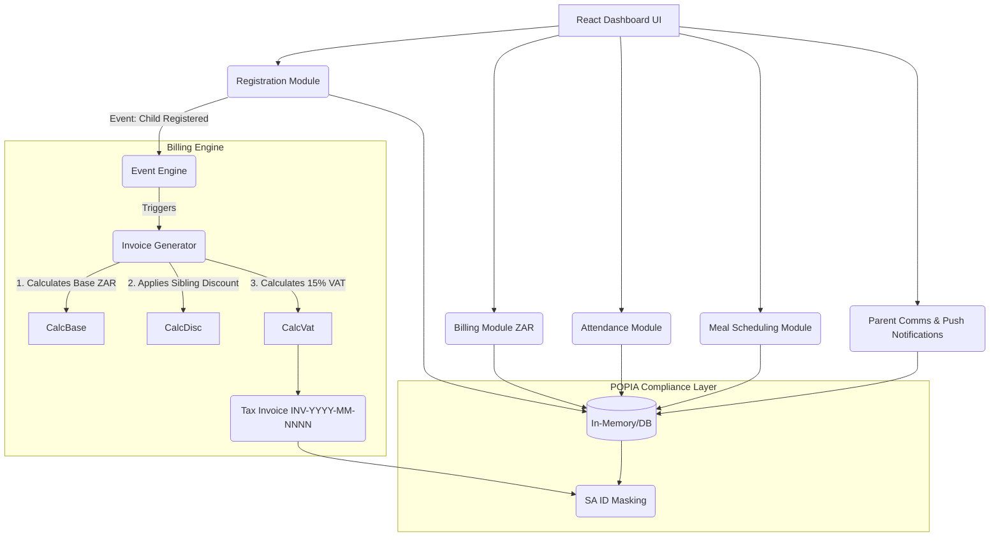

# SA Daycare Management System - Architecture

## Modular Architecture Diagram

## Description
- **Registration**: Handles children, parents, and staff. Exposes grouping logic.
- **Billing**: Listens to registrations to auto-generate itemized tax invoices.
- **Compliance Layer**: Intercepts ID payloads on output paths to enforce `***-***-XXXX-X` masking.
